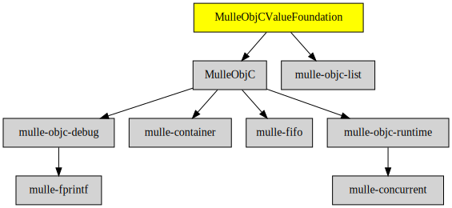

# MulleObjCValueFoundation

#### 💶 Value classes NSNumber, NSString, NSDate, NSData

These classes build on [MulleObjC](//github.com/mulle-objc/MulleObjC) and
[mulle-core](//github.com/mulle-core) to provide the usual
value classes expected in a Foundation library.

> A good distinction if a class is a value or a container is if it has a
> -count or a -length method. If it counts members with -length (number of
> bytes) it's a value.

There is no I/O in these classes. That is added by MulleObjcOSFoundation
and later libraries.


| Release Version                                       | Release Notes
|-------------------------------------------------------|--------------
|  [](//github.com/MulleFoundation/MulleObjCValueFoundation/actions) | [RELEASENOTES](RELEASENOTES.md) |


## API

### Classes

| Class             | Description
|-------------------|-----------------
| `NSData`          |
| `NSDate`          |
| `NSMutableData`   |
| `NSMutableString` |
| `NSNull`          |
| `NSNumber`        |
| `NSString`        |
| `NSValue`         |


### Protocols

| Protocol          | Description
|-------------------|-----------------
| `NSDateFactory`   |


## Requirements

|   Requirement         | Release Version  | Description
|-----------------------|------------------|---------------
| [MulleObjC](https://github.com/mulle-objc/MulleObjC) |  [](https://github.com/mulle-objc/MulleObjC/actions/workflows/mulle-sde-ci.yml) | 💎 A collection of Objective-C root classes for mulle-objc
| [mulle-objc-list](https://github.com/mulle-objc/mulle-objc-list) |  [](https://github.com/mulle-objc/mulle-objc-list/actions/workflows/mulle-sde-ci.yml) | 📒 Lists mulle-objc runtime information contained in executables.

### You are here



## Add

**This project is a component of the [MulleFoundation](//github.com/MulleFoundation/MulleFoundation) library.
As such you usually will *not* add or install it individually, unless you
specifically do not want to link against `MulleFoundation`.**


### Add as an individual component

Use [mulle-sde](//github.com/mulle-sde) to add MulleObjCValueFoundation to your project:

``` sh
mulle-sde add github:MulleFoundation/MulleObjCValueFoundation
```

To only add the sources of MulleObjCValueFoundation with dependency
sources use [clib](https://github.com/clibs/clib):


``` sh
clib install --out src/MulleFoundation MulleFoundation/MulleObjCValueFoundation
```

Add `-isystem src/MulleFoundation` to your `CFLAGS` and compile all the sources that were downloaded with your project.


## Install

Use [mulle-sde](//github.com/mulle-sde) to build and install MulleObjCValueFoundation and all dependencies:

``` sh
mulle-sde install --prefix /usr/local \
   https://github.com/MulleFoundation/MulleObjCValueFoundation/archive/latest.tar.gz
```

### Legacy Installation

Install the requirements:

| Requirements                                 | Description
|----------------------------------------------|-----------------------
| [MulleObjC](https://github.com/mulle-objc/MulleObjC)             | 💎 A collection of Objective-C root classes for mulle-objc
| [mulle-objc-list](https://github.com/mulle-objc/mulle-objc-list)             | 📒 Lists mulle-objc runtime information contained in executables.

Download the latest [tar](https://github.com/MulleFoundation/MulleObjCValueFoundation/archive/refs/tags/latest.tar.gz) or [zip](https://github.com/MulleFoundation/MulleObjCValueFoundation/archive/refs/tags/latest.zip) archive and unpack it.

Install **MulleObjCValueFoundation** into `/usr/local` with [cmake](https://cmake.org):

``` sh
cmake -B build \
      -DCMAKE_INSTALL_PREFIX=/usr/local \
      -DCMAKE_PREFIX_PATH=/usr/local \
      -DCMAKE_BUILD_TYPE=Release &&
cmake --build build --config Release &&
cmake --install build --config Release
```

## Author

[Nat!](https://mulle-kybernetik.com/weblog) for Mulle kybernetiK  


